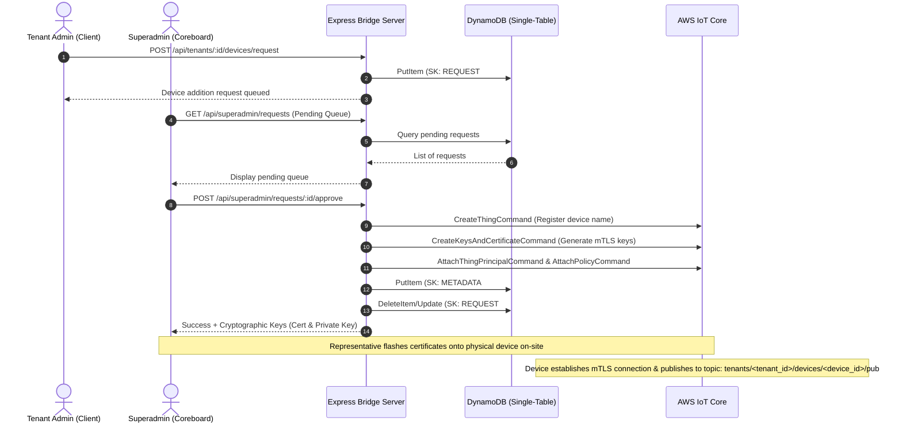

# Coreboard IoT Suite: Multi-Tenant Architecture & Roles

This document outlines the architecture, access control structure, and operational workflows for the **Coreboard IoT Suite**. 

To balance robust security, operational reality, and resource cost management, the system is structured as a **managed B2B SaaS model**. Tenants request device additions, and the Coreboard Superadmin team completes the cryptographic enrollment and physical provisioning.

---

## 🏗️ System Architecture Overview



---

## 👥 Roles & Responsibilities

The system divides access control into three distinct tiers:

### 1. SuperAdmin (Coreboard / Developer)
* **Scope**: Global system-wide control across all tenants.
* **Responsibilities**:
  * Onboard and register new Tenant Accounts.
  * Monitor global system health, connection states, and API logs.
  * Access the global **Provisioning Request Queue**.
  * Approve device enrollment, execute AWS IoT configurations, generate X.509 client credentials, and download cert packages.
  * Manage billing tier limits for each tenant.

### 2. Tenant Admin (Client Administrator)
* **Scope**: Isolated strictly to their own Tenant ID partition.
* **Responsibilities**:
  * Access the Tenant Dashboard to view live telemetry and historical logs.
  * Configure alarm threshold rules (e.g., flow rate limits, ambient temperature warnings).
  * Acknowledge and manually clear active alarms.
  * **Initiate new device additions** by adding a request with a description and device type.
  * Add and manage read-only **Tenant Users**.

### 3. Tenant User (Client Viewer)
* **Scope**: Isolated strictly to their own Tenant ID partition (Read-Only).
* **Responsibilities**:
  * Log in to the Tenant Dashboard.
  * View live telemetry widgets and historical charts.
  * View active and historical alarms.
  * *Restricted*: Cannot add devices, configure alarm rules, clear/ack alarms, or add other users.

---

## 🔒 Data Isolation & Multi-Tenancy Design

Multi-tenancy is enforced at both the database layer (for static state) and the WebSocket layer (for real-time streaming).

### A. Database Isolation (DynamoDB Single-Table Design)
All system entities reside in a single DynamoDB table. Tenant isolation is enforced logically by prefixing partition keys (`PK`) and sort keys (`SK`).

* **Partition Key (`PK`)**: `TENANT#<tenant_uuid>` (e.g., `TENANT#acme-industrial`).
* **Sort Keys (`SK`)**:
  * **Tenant Metadata**: `METADATA`
  * **User Profile**: `USER#<email>` (contains hashed passwords and roles: `'ADMIN'` or `'USER'`)
  * **Device Metadata**: `METADATA#DEVICE#<device_uuid>` (holds enrollment details and device classification)
  * **Device Setup Request**: `REQUEST#DEVICE#<device_uuid>` (temporary record representing a pending setup)
  * **Telemetry Time-Series Log**: `DEVICE#<device_uuid>#TIMESTAMP#<epoch>` (contains sensor telemetry logs)
  * **Alarm Log**: `ALARM#<alarm_uuid>` (records active/acknowledged/cleared states)

### B. WebSocket Isolation (Socket.io Rooms)
To prevent cross-tenant telemetry leaks:
1. When a frontend dashboard opens, it establishes a socket connection, passing its JWT token in the handshake.
2. The server decodes the token, extracts the `tenantId`, and puts the connection into a tenant-specific room:
   ```javascript
   socket.join(`tenant_${tenantId}`);
   ```
3. When the Bridge server receives telemetry from the MQTT broker (`tenants/+/devices/+/pub`), it parses the tenant ID from the topic and emits exclusively to that room:
   ```javascript
   io.to(`tenant_${tenantId}`).emit('telemetry', uiPayload);
   ```

---

## 🔄 Core Workflows

### 1. Tenant Onboarding Workflow
1. A prospective client contacts a Coreboard sales representative.
2. The representative registers the client, generating a unique `tenantId` (e.g. `acme-pump-corp`) and creating the initial Tenant Admin account.
3. The Tenant Admin is provided with login credentials.

### 2. Device Request & Provisioning Workflow
1. **Initiation**: The Tenant Admin clicks **"Request New Device Setup"**, enters a requested device ID (e.g. `PUMP-104`), type (`pump`), and location.
2. **Review**: The backend registers this under the tenant's partition in DynamoDB: `REQUEST#DEVICE#PUMP-104` with status `PENDING`.
3. **Approval & Creation**: A Coreboard representative visits the client's site. Once physical setup is ready, the representative approves the request from the Superadmin dashboard.
4. **AWS Setup**: The backend communicates with AWS IoT Core:
   * Registers the Thing (`CreateThingCommand`).
   * Generates mTLS credentials (`CreateKeysAndCertificateCommand`).
   * Attaches the dynamic multi-tenant policy (`AttachPolicyCommand`).
5. **Credentials Delivery**: The Superadmin dashboard displays the private key and certificate files. The representative downloads these credentials and flashes them onto the physical hardware controller (ESP32/Gateway).
6. **Activation**: The device is powered on, establishes an mTLS connection, and publishes its first payload. The backend updates the device metadata status to `active` in DynamoDB.

### 3. Alarm Threshold Management Workflow
1. The Tenant Admin logs into the dashboard, goes to the Alarms tab, and configures thresholds (e.g., *Alert if Temperature > 75°C*).
2. The alarm engine in the backend processes inbound telemetry against these thresholds.
3. If exceeded, a new alarm record is created: `ALARM#<alarm_uuid>` with status `ACTIVE`, and a real-time event is broadcasted to the tenant's WebSocket room.
4. The Tenant Admin receives the alert on their screen and can click **Acknowledge** or **Clear** to update the alarm status.

---

## 🔒 Security Best Practices

* **JWT Secret Integrity**: JWT tokens must contain the `role` and `tenantId` scopes, signed with a strong secret key.
* **AWS SDK Isolation**: The backend server must lock down AWS CLI access credentials. The frontend React client must never make direct calls to AWS.
* **X.509 Key Disposal**: Once the private key generated by AWS IoT is downloaded during provisioning, the server should not persist it in the database. Only the certificate's ARN should be stored in the device metadata.
* **Stateless Bridge**: The backend remains a stateless event-handler that logs incoming data to DynamoDB and forwards it to WebSockets without retaining temporary arrays or tables in local memory.
