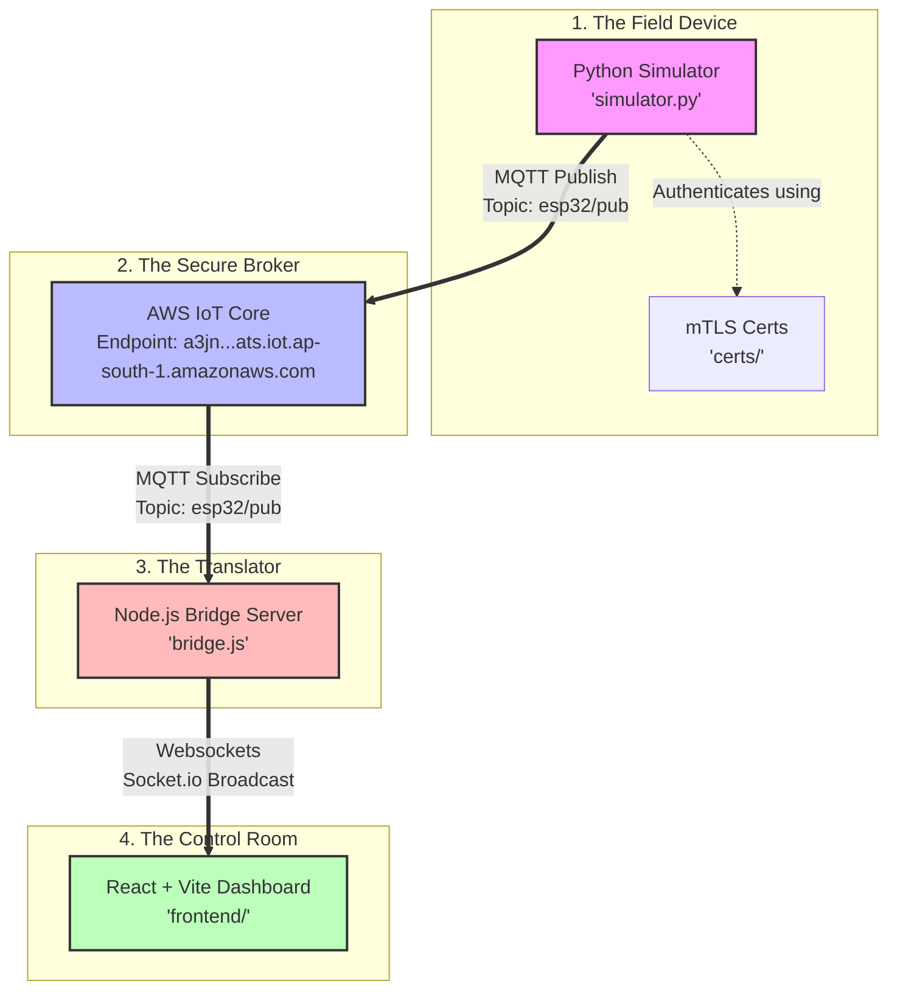

# Coreboard IoT Bridge: The Real-Time Telemetry Story

This project is a complete end-to-end IoT pipeline that simulates a physical device, securely publishes telemetry data to the cloud, streams it back to a local server, and displays it live on a web dashboard. 

Here is the story of how data flows through our system.

---

## 🏗️ System Architecture & Data Flow



---

## 📖 The Story of a Telemetry Message

Let's follow the journey of a single piece of data (like a pump's temperature) from the field to the screen:

### Step 1: The Sensor Reading (The Python Simulator)
In a remote facility, we have an industrial water pump, **`PUMP-01`**. We want to monitor its health. 
* Our Python script ([simulator.py](file:///d:/UTKARSH/GitHub/Orignal/coreboard-iot-bridge/simulator.py)) acts as the "brain" of the device.
* Every 5 seconds, it reads the sensors, generating mock telemetry data like:
  ```json
  {
    "pump_id": "PUMP-01",
    "flow_rate": 24.5,
    "temperature": 32.1
  }
  ```
* Because we need security, the simulator uses the credentials in the [certs](file:///d:/UTKARSH/GitHub/Orignal/coreboard-iot-bridge/certs) directory (Private Key, Device Certificate, and Root CA) to establish a secure, encrypted **mTLS (Mutual TLS)** connection with AWS.

### Step 2: The Cloud Post Office (AWS IoT Core)
The simulator packages the telemetry JSON and publishes it to the MQTT topic **`esp32/pub`** on **AWS IoT Core**.
* AWS IoT Core is our cloud message broker. Think of it as a highly secure, scalable post office.
* It accepts the message, verifies that our simulated device is authorized, and immediately makes the message available to any subscriber listening for topic `esp32/pub`.

### Step 3: The Translator (The Node.js Bridge Server)
We need to display this data on a local dashboard, but connecting web browsers directly to AWS IoT Core over mTLS is complex and insecure (since it would require exposing private keys to the client).
* Enter our backend translator: [bridge.js](file:///d:/UTKARSH/GitHub/Orignal/coreboard-iot-bridge/bridge.js).
* This server runs locally on port `4000`. It connects securely to AWS IoT Core as a backend client using the same certificates.
* It subscribes to the `esp32/pub` topic. The moment AWS receives a message from our pump, it forwards it to our bridge.
* When the bridge receives the MQTT message, it translates it and broadcasts it instantly to all active web dashboards using **Socket.io (Websockets)**.

### Step 4: The Control Room (The React & Vite Dashboard)
Finally, we have our human operator sitting in front of a web browser looking at our [frontend dashboard](file:///d:/UTKARSH/GitHub/Orignal/coreboard-iot-bridge/frontend).
* The dashboard is a React app built using TypeScript and Vite. It runs locally at `http://localhost:5173`.
* It opens a persistent connection to the bridge server (`http://localhost:4000`) via Socket.io.
* Whenever the bridge shouts out `"telemetry"`, the dashboard catches the JSON payload and updates the user interface instantly—updating dials, appending data to live charts, or triggering alerts if the pump gets too hot.

---

## 🛠️ How to Spin Up the System

Run these commands in separate terminal sessions from the root directory:

1. **Start the Bridge Backend**:
   ```bash
   npm run bridge
   ```
   *Connects to AWS IoT Core and awaits telemetry signals.*

2. **Start the Frontend Dashboard**:
   ```bash
   npm run dev
   ```
   *Launches the React UI at `http://localhost:5173/`.*

3. **Start the Device Simulator**:
   ```bash
   .\venv\Scripts\python simulator.py
   ```
   *Starts generating and sending telemetry data to the cloud.*
