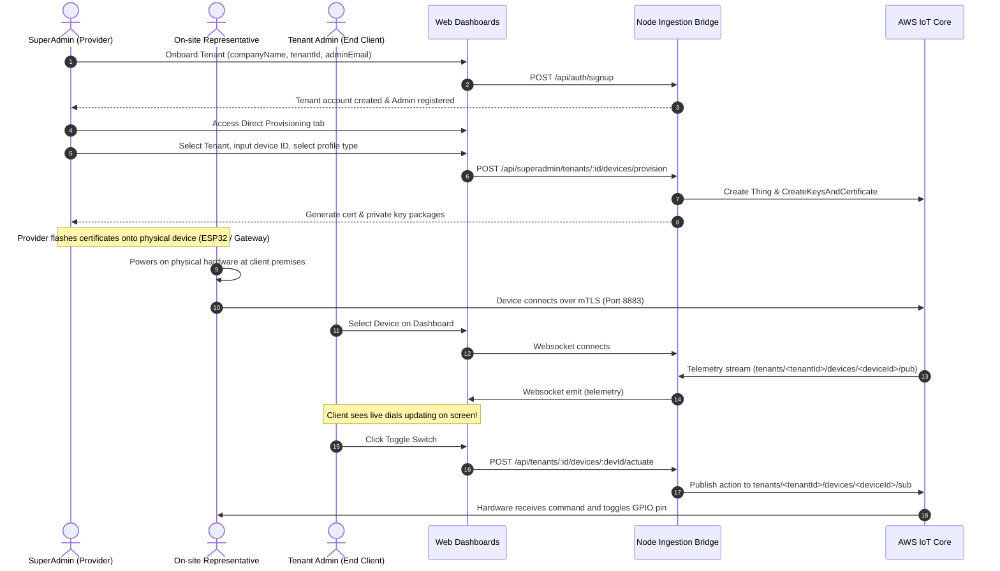

# Coreboard IoT Suite: Operator & Client Handover Guide

Welcome to the **Coreboard IoT Suite**. This custom, multi-tenant platform replaces the dependencies and licensing overhead of ThingsBoard. It provides a secure, B2B SaaS architecture tailored for embedded systems providers and smart-home/industrial installers.

---

## 👥 1. User Roles & Permission Matrix

The platform segments access controls into three distinct authorization levels to maintain security and tenant isolation:

```
                  ┌─────────────────────────────┐
                  │   SuperAdmin (Provider)     │
                  └──────────────┬──────────────┘
                                 │  (Onboards)
                  ┌──────────────▼──────────────┐
                  │    Tenant Admin (Client)    │
                  └──────────────┬──────────────┘
                                 │  (Creates)
                  ┌──────────────▼──────────────┐
                  │    Tenant User (Viewer)     │
                  └─────────────────────────────┘
```

### 🛡️ Tier A: SuperAdmin (Provider / Operator)
* **Target Audience**: Your client (the embedded systems provider company).
* **Workspace Endpoint**: `http://localhost:5175`
* **Key Capabilities**:
  * **Tenant Management**: Onboard new client organizations, automatically partitioning database schemas.
  * **Request Queue**: Review queued setup requests submitted by Tenant Admins.
  * **Dynamic Certificate Generation**: Approve requests on-site to generate unique X.509 cryptographic keys and Thing profiles.
  * **Direct Provisioning**: Provision Things and certificates directly for any selected tenant without waiting for a request slot.
  * **Logs Console**: View real-time console streams detailing active AWS IoT and database registry operations.

### 💼 Tier B: Tenant Admin (End Client Owner)
* **Target Audience**: Business owners, building managers, or domestic clients purchasing the hardware.
* **Workspace Endpoint**: `http://localhost:5173`
* **Key Capabilities**:
  * **Live Dashboard**: Monitor active telemetry and historical charts within their private organization boundary.
  * **Device Registry**: Review active hardware configurations and submit "Device Setup Requests" for new rooms or facilities.
  * **Actuation / Control**: Toggle smart relays, open doors, and activate actuators directly from the UI.
  * **Alarms Console**: Review threshold alerts, acknowledge alarms, and clear resolved warning/critical states.
  * **Sub-User Onboarding**: Create and register read-only Tenant User accounts for their staff.

### 👁️ Tier C: Tenant User (Read-Only Observer)
* **Target Audience**: Facility staff, security guards, or domestic members.
* **Workspace Endpoint**: `http://localhost:5173`
* **Key Capabilities**:
  * **Read-Only Telemetry**: View live dashboard gauges and historical logs.
  * **Alarms Watch**: View active alarms.
  * *Restricted Actions*: Cannot trigger device control commands, request new devices, configure alarm limits, or add other users.

---

## 🚀 2. Core Functionality Highlights

1. **Dynamic UI Widget Parser**:
   Rather than using hardcoded layouts, the React dashboard reads incoming telemetry schemas on the fly.
   * *Boolean* metrics (switches, smart locks, relay states) auto-render as **interactive slide switches**.
   * *Numeric* metrics (humidity, power, temperatures) auto-render as **visual gauge dials**.
   * *String* metrics (motion status, warnings) auto-render as **text status cards**.
2. **Bi-Directional Messaging**:
   * **Uplink**: Hardware streams sensor payloads using MQTT to AWS IoT Core, which the backend reads and broadcasts instantly to browsers via Socket.io.
   * **Downlink**: Operators toggle a switch in the browser, calling the backend api to publish an MQTT command back to the device to trigger relays or solenoids.
3. **Tenant-Room Security**:
   Socket connections are validated using JWTs. Sockets join tenant-isolated rooms (e.g., `tenant_acme-corp`), preventing data leaks between distinct organizations.

---

## 🔄 3. Step-by-Step Operational Workflow

This workflow tracks the lifecycle of the platform from client onboarding to on-site device setup and daily monitoring:



### Phase 1: Onboarding a New Tenant
1. The provider (SuperAdmin) logs in to `http://localhost:5175`.
2. Under the **Tenant Manager** tab, the operator inputs the client's company name (e.g., *Stark Industries*), email, and password.
3. The platform auto-generates a unique database partition slug (e.g., `stark-industries`) and registers the Tenant Admin credentials.

### Phase 2: Device Provisioning
Devices can be registered in two ways:
* **Option A: Client Request**:
  1. The client logs in to `http://localhost:5173`, navigates to **Devices**, and requests a setup (e.g., `SMART-LOCK-1` of type `smart_lock`).
  2. The SuperAdmin logs in to `http://localhost:5175`, reviews the request, clicks **Approve & Provision**, and downloads the generated X.509 credentials.
* **Option B: Direct Provisioning**:
  1. The SuperAdmin navigates to the **Direct Provisioning** tab.
  2. Selects the target tenant (e.g., `stark-industries`), enters the device ID, selects the device type, and clicks **Directly Provision**.
  3. The SuperAdmin immediately downloads the cryptographic credentials.

### Phase 3: Hardware Flashing & On-site Setup
1. A field representative copies the downloaded certificate (`device_certificate.crt`) and private key (`private_key.key`) onto the hardware's flash memory.
2. The representative installs the hardware at the client premises.
3. Upon boot, the device establishes a secure connection to AWS IoT Core over mTLS (Port 8883).

### Phase 4: Daily Operation & Remote Control
1. The hardware begins publishing sensor readings to `tenants/<tenant_id>/devices/<device_id>/pub`.
2. The client monitors the values live at `http://localhost:5173`.
3. To actuate, the client toggles a switch on the dashboard. The command is transmitted to the device's sub topic (`.../sub`), triggering the hardware relay.

### Phase 5: Hardware Integration Specifications (JSON & MQTT)
To make hardware setups completely frictionless for installation representatives:
1. Under the **Devices** tab on the **Tenant Dashboard** (`http://localhost:5173`), look at the **Registered Devices Registry** table.
2. In the rightmost column, each device row features a **`[View MQTT & JSON]`** button.
3. Clicking this button opens a modal showing:
   * The exact **Uplink (Publish)** and **Downlink (Subscribe)** topics required for that specific device ID.
   * A copy-paste ready **JSON Body Payload** customized with the matching schema keys for that device type (e.g. `flow_rate` for pumps, `lock_state` for door locks).
4. Representatives can copy this JSON directly to align their ESP32, Python simulator, or PLC code.
