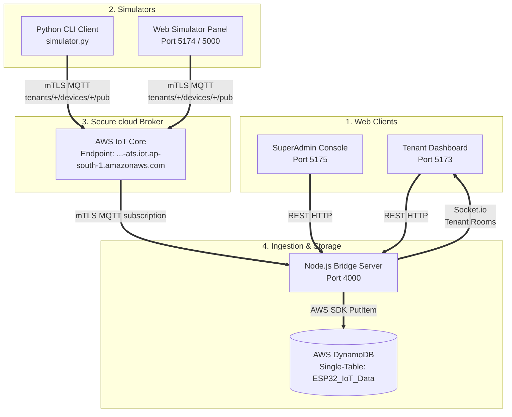

# Project Audit: Coreboard IoT Suite

This report provides a comprehensive status audit of the **Coreboard IoT Suite** codebase. It outlines the system architecture, component directories, active features, database key schemas, and operational status to help you resume development seamlessly.

---

## 🏗️ System Architecture & Data Flow

The Coreboard IoT Suite is a multi-tenant IoT pipeline structured around secure cloud messaging, a translator bridge, and decoupled frontends:



---

## 📁 Component-by-Component Audit

### 1. Root Workspace Configuration
Orchestrates dependency linking and parallel process execution using npm workspaces.
- **Location**: [`/package.json`](file:///d:/UTKARSH/GitHub/Orignal/coreboard-iot-bridge/package.json)
- **Status**: **Fully Configured**
- **Scripts Exposed**:
  * `npm run dev`: Starts the main Tenant Dashboard (Port 5173).
  * `npm run dev:superadmin`: Starts the SuperAdmin Control Center (Port 5175).
  * `npm run bridge`: Starts the Node Express Ingestion Server (Port 4000).
  * `npm run simulator`: Concurrently launches the Web Simulator Backend (Port 5000) and Web Simulator Frontend (Port 5174).
  * `npm run dev:all`: Concurrently runs the backend bridge, client dashboard, superadmin console, and web simulator in one terminal.
  * `npm run build:frontend` / `npm run build:superadmin` / `npm run build:simulator`: Builds respective bundles.
  * `npm run start:superadmin`: Production preview for the SuperAdmin dashboard.

---

### 2. Express Ingestion Bridge (Backend)
Acts as the central router, MQTT subscriber, WebSockets broadcaster, and rules engine.
- **Location**: [`/backend`](file:///d:/UTKARSH/GitHub/Orignal/coreboard-iot-bridge/backend)
- **Primary Script**: [`bridge.js`](file:///d:/UTKARSH/GitHub/Orignal/coreboard-iot-bridge/backend/bridge.js)
- **Status**: **Production Ready**
- **Core Features**:
  * **Database Validation**: Dynamically ensures the master DynamoDB table (`ESP32_IoT_Data`) exists on startup.
  * **IoT Policy Creation**: Ensures global dynamic connection policies (`MultiTenantDevicePolicy` and `MultiTenantBackendPolicy`) are set up in AWS IoT Core.
  * **MQTT Subscription**: Connects to AWS IoT Core over mTLS (using client certs) and subscribes to legacy `esp32/pub` and wildcard `tenants/+/devices/+/pub`.
  * **WebSocket Isolation**: Decodes JWT handshakes to extract tenant boundaries and assigns sockets to isolated rooms: `io.to('tenant_' + tenantId).emit('telemetry', ...)`.
  * **Rules Engine & Alarm Manager**: Asynchronously processes incoming telemetry against device type thresholds, logging alerts in DynamoDB, and broadcasting triggers in real-time.
  * **REST API Routes**:
    * Auth: Login, signup, and validation for Tenant Admins/Users and SuperAdmins.
    * Devices: Request enrollment slots (`POST`), list device status (`GET`).
    * SuperAdmin: List requests queue, approve request (triggers dynamic AWS `CreateThing`, key/certificate generation, policy mapping, and delivers downloads).
    * Alarms: List alarms, acknowledge alarm (`POST`), clear alarm (`POST`).

---

### 3. Tenant Dashboard (Frontend)
Decoupled UI client strictly for B2B client organizations.
- **Location**: [`/frontend`](file:///d:/UTKARSH/GitHub/Orignal/coreboard-iot-bridge/frontend)
- **Primary Page**: [`App.tsx`](file:///d:/UTKARSH/GitHub/Orignal/coreboard-iot-bridge/frontend/src/App.tsx)
- **Status**: **Fully Segregated & Cleaned**
- **Core Features**:
  * **Role Restriction**: Restricts registration/login to `'ADMIN'` (Tenant Admin) and `'USER'` (Tenant User) roles. No SuperAdmin elements are compiled in this workspace.
  * **Data Visualization**: Real-time dials (flow rate, temperature, humidity, pressure, current, power) and dynamic charts (re-rendering via Socket.io streams).
  * **Alarm Console**: Visual logs with color indicators for ACTIVE, ACKNOWLEDGED, and CLEARED alarms. Admins can ack/clear alarms.
  * **Enrollment Request**: Form for Tenant Admins to place device provisioning requests.

---

### 4. SuperAdmin Control Center (Frontend)
Operator dashboard isolated for developers to onboarding tenants and flashing devices.
- **Location**: [`/frontend-SuperAdmin`](file:///d:/UTKARSH/GitHub/Orignal/coreboard-iot-bridge/frontend-SuperAdmin)
- **Primary Page**: [`App.tsx`](file:///d:/UTKARSH/GitHub/Orignal/coreboard-iot-bridge/frontend-SuperAdmin/src/App.tsx)
- **Status**: **Newly Scaffolded & Completed**
- **Core Features**:
  * **Gatekeeping**: Requires a custom secret key (`SUPERADMIN_SIGNUP_SECRET`) to create accounts.
  * **Tenant Manager**: Dynamic organization creator that provisions database partition schemas and sets up the primary admin credentials.
  * **Device Approval Console**: Monitors incoming DynamoDB request slots. Clicking "Approve" triggers AWS mTLS certificate creation and delivers downloadable private/public PEM packages.
  * **AWS Terminal Stream**: Log box displaying active steps from AWS IoT and DynamoDB during hardware provisioning.

---

### 5. Universal Device Simulators
A set of script tools to simulate telemetry.
- **Locations**: [`/simulators`](file:///d:/UTKARSH/GitHub/Orignal/coreboard-iot-bridge/simulators) (Python CLI/GUI) and [`/simulator-ui`](file:///d:/UTKARSH/GitHub/Orignal/coreboard-iot-bridge/simulator-ui) (Web UI)
- **Status**: **Fully Functional**
- **Core Features**:
  * **Python Script (`simulator.py`)**: Runs CLI simulation loops. Connects to AWS via `awsiot` SDK using the cert files.
  * **Web Simulator Backend (`server.js`)**: Orchestrates a pool of connected virtual devices. Dynamically uploads certificates to connect virtual clients to AWS IoT Core.
  * **Web Simulator Client**: Renders slider panels, baseline controllers, auto-generator loops (generating noise every 3s), and manual alarm trigger buttons to simulate fault states.

---

## 🗄️ DynamoDB Single-Table Partition Schema

Logical segregation is enforced in the master table using the following index patterns (where `PK` = `device_id` and `SK` = `timestamp` in the queries):

| Partition Key (`PK` / `device_id`) | Sort Key (`SK` / `timestamp`) | Entity Represented | Attributes Logged |
| :--- | :--- | :--- | :--- |
| `TENANT#<tenant_id>` | `USER#<email>` | User Account Profile | `role`, `password_hash`, `company_name` |
| `TENANT#<tenant_id>` | `DEVICE#<device_id>#TIMESTAMP#<epoch>` | Telemetry Log | `data` (flow_rate, temperature, pressure, etc.), `device_type`, `status` |
| `TENANT#<tenant_id>` | `ALARM#<alarm_uuid>` | Alarm Log | `status` (ACTIVE/ACKNOWLEDGED/CLEARED), `severity`, `trigger_value`, `message` |
| `TENANT#<tenant_id>` | `REQUEST#DEVICE#<device_id>` | Device Setup Request | `deviceType`, `created_at` (temporary slot) |
| `TENANT#<tenant_id>` | `METADATA#DEVICE#<device_id>` | Device Configuration | `status` (ACTIVE), `device_type`, `created_at` |

---

## 🚨 Rules Engine Thresholds

The backend translates raw telemetry and evaluates alerts using the following baseline thresholds:

1. **Water Pump (`pump`)**:
   - `temperature > 70°C` ➡️ **CRITICAL** High Temperature
   - `temperature > 60°C` ➡️ **WARNING** High Temperature
   - `flow_rate < 15 L/min` ➡️ **WARNING** Low Flow Rate
2. **Ambient Temp Sensor (`temp_sensor`)**:
   - `temperature > 38°C` ➡️ **WARNING** Elevated Ambient Temp
   - `humidity > 90%` ➡️ **WARNING** Elevated Ambient Humidity
3. **Pressure Sensor (`pressure_sensor`)**:
   - `pressure > 5.0 Bar` ➡️ **CRITICAL** High Pressure
   - `pressure > 4.5 Bar` ➡️ **WARNING** Elevated Pressure
4. **Power Meter (`power_meter`)**:
   - `power > 1.2 kW` ➡️ **WARNING** Power Overload

---

## 🚀 Steps to Resume Local Testing

1. **Install Dependencies**:
   ```bash
   npm install
   ```
2. **Launch Services**:
   Open a terminal and run:
   ```bash
   npm run dev:all
   ```
3. **Validate Interfaces**:
   - Open standard dashboard: [http://localhost:5173](http://localhost:5173) (Sign up as Tenant Admin).
   - Place a device request slot (e.g., `PUMP-101`, `pump`).
   - Open SuperAdmin panel: [http://localhost:5175](http://localhost:5175) (Sign up with `coreboard-superadmin-secret-key-2026`).
   - Go to Pending Requests, click **Approve & Provision**, and download the cert/private key.
   - Open Universal Simulator: [http://localhost:5174](http://localhost:5174).
   - Enter your endpoint, `PUMP-101`, upload the downloaded certificate and private key, and click **Connect**.
   - Check the Tenant Dashboard at `localhost:5173` to see live telemetry streaming in!
